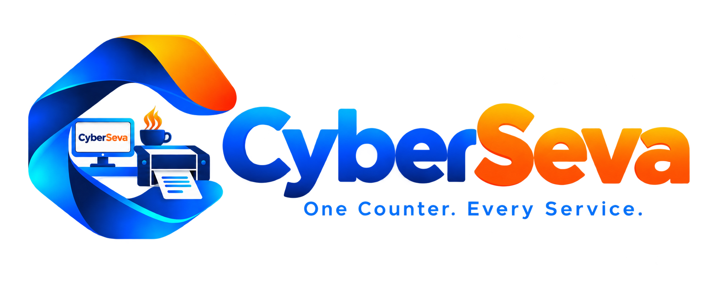

# CYBERSEVA (साइबर सेवा)
### *"One Counter. Every Service."*
### एक काउंटर। हर सेवा।

[](https://reactjs.org/)
[](https://vitejs.dev/)
[](https://www.typescriptlang.org/)
[](https://tailwindcss.com/)
[](https://nodejs.org/)
[](https://opensource.org/licenses/MIT)



**CyberSeva** is a complete, modern, visual "Digital Service Counter Operating System" built specifically for Indian cyber cafés, Common Service Centres (CSCs), Jan Seva Kendras, and print/scan shops.

Instead of making operators juggle complex image editors, confusing PDF utilities, or messy WhatsApp chats with walk-in customers, CyberSeva streamlines all daily counter operations into an **extremely clean, tactile, Apple-like workspace** that anyone can use in under 30 seconds.

---

## ✨ Key Features & Architecture

### 🪪 1. 10 Visual Tool Boxes with Real Card Imagery
Every counter service is represented by an instantly recognizable photographic/3D image icon:
- **आधार कार्ड प्रिंट (Aadhaar Smart Print):** Automatically aligns Front & Back on a single A4 page with fold and lamination lines. Includes optional Aadhaar number masking (`XXXX XXXX 1234`) and B&W/Color toggles.
- **पैन कार्ड प्रिंट (PAN Card Service):** Official Income Tax Department card layout with photo, signature, chip, and PVC card standard dimensions (85.6mm × 54mm).
- **पासपोर्ट साइज फोटो (Passport Photo Studio):** Instant 8-up or 16-up glossy photo sheet generator with cutting marks, background replacement (White, Light Blue, Light Gray), and SSC/Railway applicant name and DOP date strip.
- **मतदाता पहचान पत्र (Voter ID / EPIC):** Election Commission identity card A4 layout with cutting guidelines.
- **आयुष्मान भारत गोल्डन कार्ड (Ayushman PM-JAY):** 5 Lakh health beneficiary card layout with 1-click print.
- **एडमिट कार्ड व फॉर्म (Admit Card & Govt Exams):** Official SSC, Railway, Police, and UPSC hall ticket printing.
- **PDF टूल्स व साइज कम करें (PDF Tools & Govt Portal Compressor):** Combine admit cards and marksheets into a single file, delete unwanted pages, or compress documents under 500 KB for government portal uploads.
- **कस्टमर मोबाइल QR (Customer Mobile Direct QR):** Walk-in customer scans a counter QR code with their phone camera to send photos or PDFs directly to the counter — zero WhatsApp number exchange needed.
- **बिजली बिल व भुगतान (Electricity Bill & Utility Pay):** State electricity bill payment helper with instant printed customer bill receipts and dynamic UPI payment QR.
- **फोटोकॉपी व लैमिनेशन (Xerox & Lamination):** Quick photocopy billing, A4/A3 single & double-sided rates, and hot thermal lamination pouch management.

---

### 🌐 2. 3-Language Instant Switcher
- **English:** Clean terminology for English-speaking operators.
- **Hinglish:** Natural conversational phrasing for Indian shopkeepers (`Aaj ki Kamai`, `Aadhaar aage piche print karein`, `Photo banayein`, `Sabse Zyada Chalne Wala`).
- **हिन्दी (Hindi):** Complete Devanagari translation for regional operators (`काउंटर होम`, `आधार कार्ड प्रिंट`, `पासपोर्ट साइज फोटो`, `PDF टूल्स व साइज कम करें`).
- Automatically remembers language preferences in local storage.

---

### 🔤 3. Accessibility & Font Size Controller
- **`A-` (Small):** Compact layout for high-density monitors.
- **`A` (Medium):** Balanced default counter layout.
- **`A+` (Large):** High-legibility mode for shopkeepers needing larger typography, scaling text, cards, and tables smoothly without layout distortion.

---

### ❓ 4. Help & Counter Guide Modal
- **Keyboard Shortcuts:**
  - `Ctrl + P` ➔ Instant Print Spooler dialog
  - `Ctrl + N` ➔ Jump back to Counter Home
  - `Esc` ➔ Close any open popup or modal
- **30-Second Counter Tips:** Step-by-step guides for 10-second Aadhaar prints, 15-second passport sheets, and WhatsApp-free customer file transfers.
- **Helpline Card:** Direct counter support contact information.

---

### 🛡️ 5. Privacy-First Counter Shield
Customer documents (Aadhaar cards, photos, marksheets) are processed strictly in local client memory and automatically wiped clean from memory once printed, protecting citizens' identity and privacy.

---

## 🛠️ Tech Stack

- **Frontend:** React 18, TypeScript, Vite, TailwindCSS, Lucide Icons, Canvas 2D API, PDF-Lib.
- **Backend:** Node.js, Express, TypeScript, tsx, REST API.
- **Storage:** Local in-memory store with atomic JSON state persistence.
- **Print Spooler:** Native HTML5 canvas rasterization at 300 DPI with cut-mark guides.

---

## 🚀 Getting Started

### Prerequisites
- Node.js (v18.0.0 or higher)
- npm (v9.0.0 or higher)

### Installation

1. **Clone the repository:**
   ```bash
   git clone https://github.com/ShubSaurav/cyberseva.git
   cd cyberseva
   ```

2. **Install Backend Dependencies:**
   ```bash
   cd backend
   npm install
   ```

3. **Install Frontend Dependencies:**
   ```bash
   cd ../frontend
   npm install
   ```

### Running Locally

1. **Start Backend Server:**
   ```bash
   cd backend
   npm run dev
   # Server runs on http://localhost:5001
   ```

2. **Start Frontend Dev Server:**
   ```bash
   cd frontend
   npm run dev
   # Web app opens on http://localhost:3000
   ```

---

## 📄 License
This project is licensed under the MIT License - see the [LICENSE](LICENSE) file for details.

---

Made with ❤️ for Indian Cyber Cafés, CSCs & Jan Seva Kendras.
